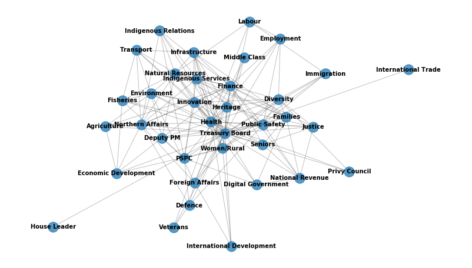
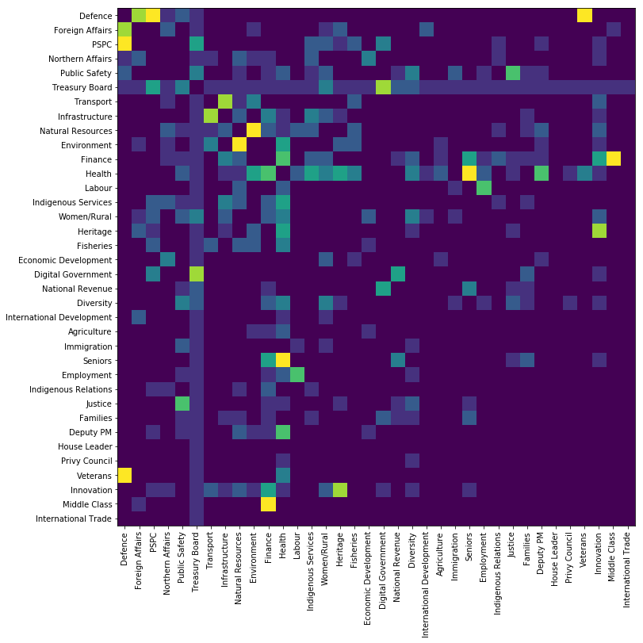

# Mandate letter analysis with GNU/Linux tools

This document shows the technical details of using Linux shell commands to look at relationships in the Canadian Federal Government. Last week, the government publishes mandate letters for the new cabinet. Each minister gets a mandata letter from the Prime Minister laying out the important priorities for that ministry. Our goal is to analyze these for cross references, to understand how the ministries work together. For example, the Minister of National Defence is asked to work with Public Services and Procurement Canada and Veteran's Affairs to deliver his mandate.

## Data

The mandate letters are available online here: 

https://pm.gc.ca/en/mandate-letters

There are 36 mandate letters. Our rough workflow will be to download them all, then for each letter, make a list of mentions of other ministries. 

Cutting to the chase, if we look at the `html` for the letter's index page, we find that the links to each letter are in the form:

```html
href="/en/mandate-letters/..."
```

and there are no other links beginning this way. Pulling out these links then is just a matter of matching for this pattern and keeping everything in the path after the `/en/mandate-letters/` folder. We can do this with `grep`:

```bash
curl https://pm.gc.ca/en/mandate-letters > mand_index.html
cat mand_index.html | grep -E -o '/en/mandate-letters/[^"]*' > letter_urls
```

The URLs look like

```bash
$ cat letter_urls 
/en/mandate-letters/minister-national-defence-mandate-letter
/en/mandate-letters/minister-transport-mandate-letter
/en/mandate-letters/minister-natural-resources-mandate-letter
/en/mandate-letters/minister-infrastructure-and-communities-mandate-letter
/en/mandate-letters/minister-fisheries-oceans-and-canadian-coast-guard-mandate-letter
```

The `-o` flag makes `grep` return the matched string only, and the regular expression matches a string beginning with `/en/mandate-letters/` and ending at the first double quotation mark. We now have a list of URLS for all the letters.

The short script `scrape` below will download the letters:

```bash
#!/bin/bash
cat ../letter_urls | while read line1
do 
    echo  ${line1##*/}
    curl -s "https://pm.gc.ca$line1" > ${line1##*/}     
done
```

I put this in a folder called `files`, thus the `../` in the path. Each file gets the name of the Ministry, but using `${line1##*/}` to strip away the rest of the path. The `${var##pattern}` syntax removes the longest string matching `pattern` from `var`. 

The directory listing looks like:

```bash
$ ls
deputy-prime-minister-and-minister-intergovernmental-affairs-mandate-letter
leader-government-house-commons-mandate-letter
minister-agriculture-and-agri-food-mandate-letter
minister-canadian-heritage-mandate-letter
minister-crown-indigenous-relations-mandate-letter
minister-digital-government-mandate-letter
...
```

## Processing

We have a list of URLs, and the files, but not an explicit list of ministries for matching. The URLs all contain the full name of the ministry, so this is just a matter of stripping off the rest of the URLs we have:

```bash
cat letter_urls | awk -F- '{for (k=3;k<NF-2;k++) {printf "%s ",$k}; printf "%s\n",$(NF-2)}' > ministries
```

The code above takes advantage of the hyphens in the URLs to split everything up to and including `-minister` off the front and `-mandata-letter` off the end.   
One last detail: the letters contain some boilerplate that mentions finance and labour, also the names of ministries. Keeping this in would artificially inflater the mention count of these ministries, so we create a file `boilerplate` that contains parts of the offending sentences.

```bash
$ cat boilerplate
including businesses of all sizes, organized labour
from making their lives more affordable and strengthening the healthcare system
```

These lines will get removed from all the letters before we see what ministries were mentioned.

Now the fun part - an executable called `links`:

```bash
#!/bin/bash
	
while IFS= read -r line2; do
	echo "***${line2##*/}***"
	cat "files/${line2##*/}" | grep -v -f boilerplate | tr '[:upper:]' '[:lower:]' | grep -o -f ministries
done < letter_urls
```

We read through the URLs (corresponding to file names in `./files/`) and for each, we print the name of the current file, with some prominent asterisks around it. We pipe the file into the following workflow:

1. `grep` removes the boilerplate with the `-v` option (inverse match), meaning those lines are left out. 
2. Make everything lowercase to match the ministry names derived from URLs
3. Use `grep` again, printing only the matching part of the lines that match a name in the list of ministries.

Piping the output of this script into a file, we get:

```bash
$ ./links > extracted_links
$ cat extracted_links
head -20 extracted_links2
***minister-national-defence-mandate-letter***
national defence
foreign affairs
foreign affairs
public services and procurement
public services and procurement
public services and procurement
national defence
foreign affairs
northern affairs
public safety and emergency preparedness
...
```
We now have extracted the information we need - we know which ministries were mentioned in each mandate letter. Since we want to make a graph out of it, further processing is made easier by turning this into a set of edges, just pairs of ministries with mutual mentions:

```bash
cat extracted_links | tr '-' ' ' | awk '$0~"\*" {gsub(/\*/,"");split($0,y);ly=0;for (yy in y) ly++; x="";for (yy=2;yy<(ly-2);yy++) {x=sprintf("%s%s ",x, y[yy])}; x=sprintf("%s%s",x,y[ly-2])} {printf "%s\t%s\n", x, $0}' > graph.txt
```

This is the kind of script I really like. It takes out the hyphens using `tr` (why were they still there anyway), and uses `awk` to match lines with an asterisk (the beginning of a new ministry) to set variable `x` to the ministry's name. Then it prints `x` followed by the current line (the mentioned ministry), and separated by a tab. 

The `***` separator lines are still passed through, so to clean up, we do

```bash
cat graph.txt | grep -v mandate > graph2.txt
```

which gets rid of those separating lines because they still say `mandata letter`. And that's it. The final file is a list of connections between ministries:

```bash
$ cat graph2.txt  
national defence	national defence
national defence	national defence
national defence	foreign affairs
national defence	foreign affairs
national defence	public services and procurement
national defence	public services and procurement
national defence	public services and procurement
national defence	national defence
national defence	foreign affairs
national defence	northern affairs
national defence	public safety and emergency preparedness
national defence	national defence
...
``` 

In a few short scripts, we were able to extract the URLs leading to the mandate letters, download them, and extract links from them. To visualize their relationship, we can now go to python:

## Visualization and Analysis

```python
import networkx as nx

G2 = nx.Graph()
with open("graph2.txt") as fp:
   lines = fp.readlines()
```

In order to make the data easy to visualize, it helps to shorten the names. So we define a dictionary to do this:

```python
ministry_dict = {
    "national defence":"Defence",
"transport":"Transport",
"natural resources":"Natural Resources",
"infrastructure and communities":"Infrastructure",
"fisheries oceans and canadian coast guard":"Fisheries",
"treasury board":"Treasury Board",
"public services and procurement":"PSPC",
"international development":"International Development",
"agriculture and agri food":"Agriculture",
"immigration refugees and citizenship":"Immigration",
"digital government":"Digital Government",
"seniors":"Seniors",
"finance":"Finance",
"canadian heritage":"Heritage",
"employment workforce development and disability inclusion":"Employment",
"indigenous services":"Indigenous Services",
"crown indigenous relations":"Indigenous Relations",
"labour":"Labour",
"health":"Health",
"public safety and emergency preparedness":"Public Safety",
"diversity and inclusion and youth":"Diversity",
"environment and climate change":"Environment",
"justice and attorney general canada":"Justice",
"national revenue":"National Revenue",
"families children and social development":"Families",
"prime minister and minister intergovernmental affairs":"Deputy PM",
"government house commons":"House Leader",
"women and gender equality and rural economic development":"Women/Rural",
"queens privy council canada":"Privy Council",
"veterans affairs and associate minister national defence":"Veterans",
"innovation science and industry":"Innovation",
"foreign affairs":"Foreign Affairs",
"middle class prosperity and associate minister finance":"Middle Class",
"small business export promotion and international trade":"International Trade",
"northern affairs":"Northern Affairs",
"economic development and official languages":"Economic Development"
}
```

Now we can read in all the pairs from our file, and count each time a pair is mentioned:

```python
for l in lines:
    link = [ministry_dict[t] for t in l.strip().split('\t')]
    if (link[0],link[1]) in G2.edges():
        G2.edges[link[0],link[1]]['weight']+=1
    else:
        G2.add_edge(link[0],link[1],weight=1)
```

The graph looks like this:



The code to produce this plot is as follows:

```python
plt.figure(figsize=(14,8))
nx.draw_networkx_nodes(G2,pos,with_labels=True,alpha=0.75)
nx.draw_networkx_edges(G2,pos,with_labels=True,alpha=0.25)
nx.draw_networkx_labels(G2,pos,font_size=10,font_family='sans-serif',font_color='black',font_weight='bold')
plt.xlim((-1.1,1.3))
plt.axis('off')
plt.show()
```

An observation is that although there are a couple of outliers like International Trade and the House Leader, for the most part the connections look pretty dense, and without specific clusters or groups. Optimistically, this looks like lots of collaboration with good inclusion of most of the ministries. 

Additionally, Finance and Treasury board appear at the middle, with an above average number of links. This is what we would expect to see for central agencies. Expanding on that, here are the number of links for some of the top connected ministries. The number after each pair is the number of connections to others:

```python
>>> cons = [(n,len(G2[n])) for n in G2]
>>> sorted(cons, key=lambda tup: tup[1],reverse=True)

[('Treasury Board', 36),
('Health', 22),
('Finance', 20),
('Natural Resources', 16),
('Public Safety', 15),
('Innovation', 14),
('Women/Rural', 13),
('Diversity', 13),
('Northern Affairs', 12),
('Environment', 12),
('PSPC', 11),
('Infrastructure', 11),
('Indigenous Services', 11),
('Heritage', 10),
('Families', 10),
('Foreign Affairs', 9)
...
```

The Treasury board is actually connected to everyone, not surprising given their role handling the money. Health and finance are also high on the list. These may be overrepresented slightly because `health` in particular is also a common word, that might not always refer specifically to collaborating with the minister. 
Another interesting way to look at the connections if the Adjacency matrix of the graph, which shows the connections as a heat map of the number of mutual mentions between ministries in their letters. The heat map is symmetrical, because it counts the mentions between the pair, so whether we consider mutual mentions between defence and procurement, or procurement and defence, it will be the same number.   



The code producing the plot is as follows:

```python
nodelist = [n for n in G2.nodes()]
plt.figure(figsize=(12,12))
A = nx.adjacency_matrix(G2).todense()
for i in range(len(A)):
    A[i,i]=0
plt.imshow(A)
xt = np.arange(len(A))
plt.xticks(xt,nodelist,rotation=90)
plt.yticks(xt,nodelist)
plt.clim(0,7)
plt.show()
```

There are lots of interesting observations from this heatmap. The way to read it is to look for the intersection between a row and a column. The brighter the color at that intersection, the more mutual mentions. For example, defence has lots of co-mentions with procurement (PSPC), Foregin Affairs, and Veteran's Affairs. Treasury Board is connected to all the other ministries, but has strongest connections to PSPC, Public Safety, Women and Rural Affairs, and Digital Government. This last connection is the strongest, presumably because Treasury Board is closely linked with the Digital Government initiatives. 

Health has lots of connections, but it is most strongly linked to Seniors. Labour and Employment have a strong link, as do Innovation and Heritage. The newly created Minister of Middle Class Prosperity has a strong link to Finance (in fact the most mutual mentions of any ministry pair), because she is also the Associate Minister of that department. 

For political observers, there are doubtless many mentions, or absences of mentions worth exploring. Here we have demonstrated a quick way of extracting these connections from the set of mandate letters.  
